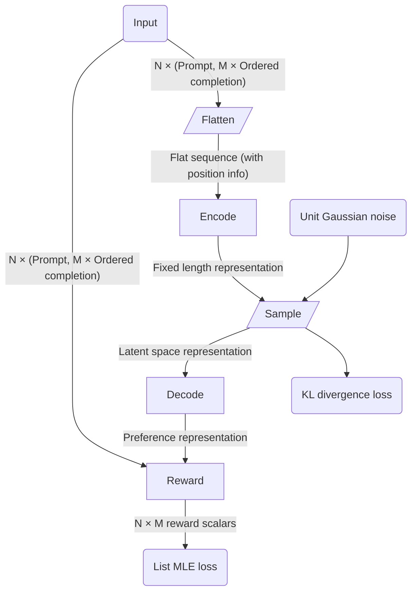

```mermaid
flowchart TB
    input(Input) -->|"N × (Prompt, M × Ordered completion)"| reward[Reward]
    input -->|"N × (Prompt, M × Ordered completion)"| flatten[/Flatten/]
    flatten -->|"Flat sequence (with position info)"| encode[Encode]
    encode -->|Fixed length representation| sample[/Sample/]
    noise(Unit Gaussian noise) --> sample
    sample --> kl(KL divergence loss)
    sample -->|Latent space representation| decode[Decode]
    decode -->|Preference representation| reward
    kl ~~~ reward
    reward -->|N × M reward scalars| output(List MLE loss)

```

<!-- markdownlint-disable-file MD041 -->